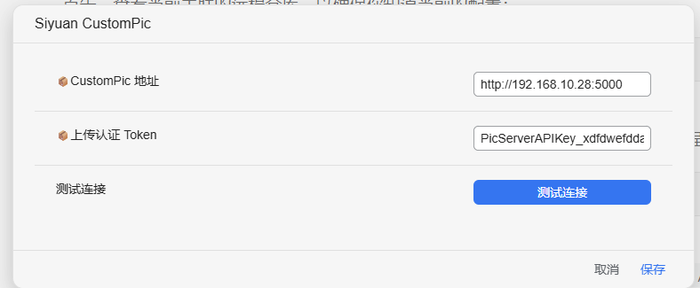

# Siyuan Custom Pic Server Plugin

## Introduction

[中文](/README_zh_CN.md)

This is an image hosting plugin for SiYuan Note:

- Upload image/video assets in your notes to your configured server (self-hosted image hosting).
- Export `.md` files compatible with `vuepress-theme-vdoing`.
- This repository also includes a **Flask backend adapter** (`backend/`) as a simple image hosting service.

## Usage

1. Install and enable the plugin.
2. Open plugin settings.
3. Fill in server address (`baseURL`) and Token (optional, depending on backend config).
4. Click "Test Connection" to verify reachability.
5. In the editor, right-click an asset and run "Upload to CustomPic".



By default, upload scope includes common image and video formats (`jpg/png/webp/gif/mp4/mov/mkv`, etc.).

## Features

1. Manual upload via right-click context menu.
2. Uploaded-file existence check by resource path (`documentExists`).
3. Optionally replace asset paths in current block with server direct URLs after successful upload.
4. Complete Flask backend API docs for custom backend integration.

## API Documentation

The **server address (`baseURL`)** configured in plugin settings determines where requests go:

- If it points to the built-in **Flask backend** (`backend/`, see [backend/README.md](./backend/README.md)), the API contract below applies.
- All paths below are relative to `baseURL`. For example, if `baseURL` is `http://192.168.1.2:5000`, full URLs are `http://192.168.1.2:5000/api/...`.

### Authentication

If server env var **`PAPERLESS_TOKEN`** is configured, protected endpoints require this header:

```http
Authorization: Token <same value as in .env>
```

If no token is configured, headers are optional unless explicitly stated otherwise.  
**Exception**: `GET /api/files/...` **never validates Token** (to allow direct image loading in notes). Do not expose this service to untrusted networks.

### `GET` / `POST` `/api/testConnection`

- **Purpose**: used by plugin "Test Connection" (direct `fetch`, not SiYuan forwardProxy).
- **Auth**: not required.
- **Response example**:

```json
{ "success": true }
```

### `GET /api/documentExists/` or `GET /api/documentExists/<path:path>`

- **Purpose**: check whether resource file exists (path is mapped into relative path under `files/`).
- **Auth**: required if `PAPERLESS_TOKEN` is configured.
- **Arguments** (choose one):
  - Query param: `/api/documentExists/?path=/data/assets/xxx.png` (currently used by plugin)
  - Path param: `/api/documentExists/data/assets/xxx.png`
- **Success response example (exists)**:

```json
{
  "success": true,
  "path": "/data/assets/xxx.png",
  "exists": true,
  "count": 1,
  "results": [
    {
      "path": "/data/assets/xxx.png",
      "file_url": "/api/files/assets/xxx.png"
    }
  ]
}
```

- **Success response example (not exists)**:

```json
{
  "success": true,
  "path": "/data/assets/not-found.png",
  "exists": false,
  "count": 0,
  "results": []
}
```

### `POST /api/documents/post_document/`

- **Purpose**: upload file to local `DOCUMENT_DATA_DIR/files/`.
- **Auth**: required if `PAPERLESS_TOKEN` is configured.
- **Content-Type**: `multipart/form-data`
- **Form fields**:

| Field | Required | Description |
| --- | --- | --- |
| `document` | Yes | file binary content |
| `title` | Recommended | display title, usually same as file name from plugin |
| `path` | No | SiYuan workspace path, e.g. `/data/assets/xxx.png`; if provided, mapped into relative path under `files/` with security normalization |

- **Success response** `200`, `Content-Type: application/json`:

```json
{
  "success": true,
  "id": "<uuid generated per request>",
  "file_url": "/api/files/assets/xxx.png"
}
```

`file_url` is a **relative path**. Plugin will join it with `baseURL` for final URL.  
If `path` is omitted, disk file name is `{uuid}_{safe_basename}{ext}`. In this case `file_url` is still `/api/files/...`. If URL is a **single UUID segment**, server will resolve via `files/{uuid}_*`.

- **Failure response**: `4xx` JSON with fields like `success: false`, `detail`, `message` (depends on actual return).

### `GET /api/files/<path>`

- **Purpose**: read uploaded file for browser/embedded image rendering.
- **Auth**: **not required** (see security note above).
- **Path rules**:
  - **Multi-segment path** (e.g. `assets/xxx.png`): matches relative path written under `files/` (with same safety normalization as upload).
  - **Single UUID segment** (e.g. `550e8400-e29b-41d4-a716-446655440000`): returns unique file in `files/` prefixed by `{uuid}_` (for uploads without `path`).
- **Success**: file stream (`send_file`).
- **Failure**: `404` / `400` JSON, e.g. `{"detail":"not found"}`.

### `GET /health`

- **Purpose**: health check.
- **Auth**: not required.
- **Response example**:

```json
{ "ok": true, "data_dir": "C:\\...\\backend\\data" }
```

### CORS

Flask app already allows CORS on `/api/*` for browser-side access from SiYuan; desktop usage also works.

### More Deployment Details

For env vars, bind address, firewall, and directory layout, see **[backend/README.md](./backend/README.md)**.

This project is adapted from [Jasaxion/siyuan-paperless](https://github.com/Jasaxion/siyuan-paperless/).

If this plugin helps you, please give it a ⭐ Star. Thanks!

