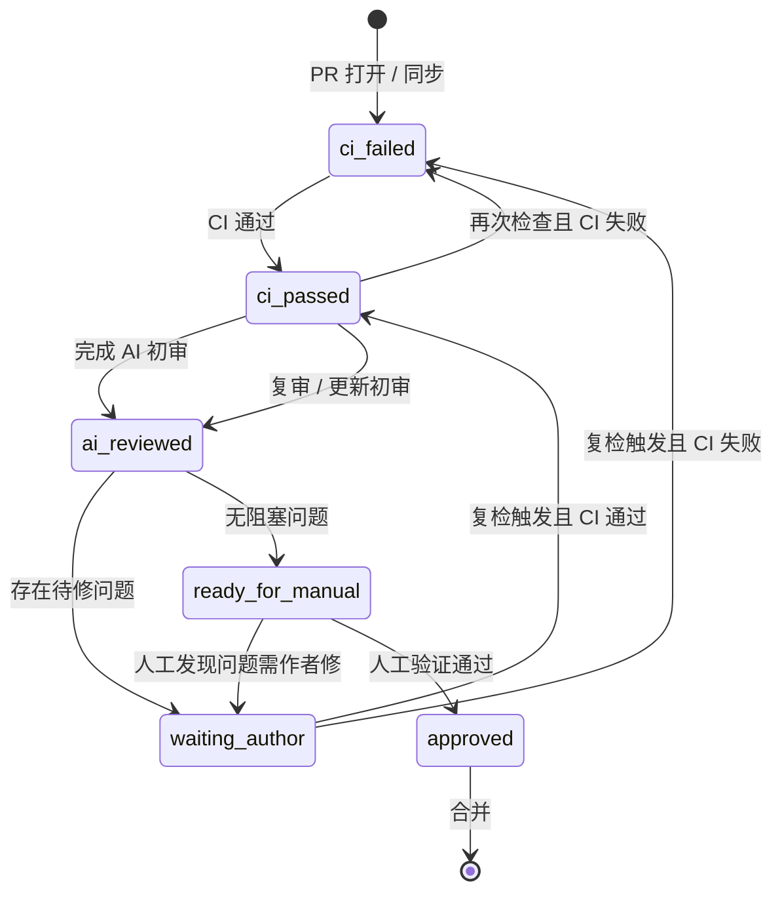

# 集市流程设计

## 目标

把集市仓库拆成清晰的两层：

- **流程层**：PR Check、Stage —— 负责触发时机、diff、并发、上传、回写、评论
- **能力层**：Pkg Check —— 负责对**单个**集市包做检查，返回结构化结果

两者主要流程不同，但都包含「检查集市包」步骤；检查能力集中在一处，避免 PR Check 与 Stage 各写一套。

## 模块划分

```
┌─────────────────────────────────────────────────────────────┐
│  PR Check（审核 PR）                                          │
│  · 解析 TXT diff / 限制一次一个包 / 换维护者提示               │
│  · 改标题、打类型标签 / 把检查结果写成 PR 评论                   │
└──────────────────────────┬──────────────────────────────────┘
                           │ 调用
                           ▼
┌─────────────────────────────────────────────────────────────┐
│  Pkg Check（检查单个集市包）· 包路径 `check/`                   │
│  · 输入：解压根目录 + OwnerRepo + Type + 可选上下文              │
│  · 输出：Result（OK + Issues；Issue 含 Rule / 中英 Message）   │
│  · 内部：rules.Context 流水线；前置失败 Halt，后续步骤自跳过     │
└──────────────────────────▲──────────────────────────────────┘
                           │ 调用
┌──────────────────────────┴──────────────────────────────────┐
│  Stage（拉取更新）                                            │
│  · 扫列表 / hash 跳过 / 下载 zip / 上传 OSS / 写 stage.json   │
│  · 失败回退旧数据、记错                                        │
└─────────────────────────────────────────────────────────────┘
```

| 模块 | 职责 | 不负责 |
| --- | --- | --- |
| **Pkg Check** | 对单个已解压包根做确定性检查，返回 `Result`；规则集中在 `check/rules` | PR diff、并发、OSS、stage.json、发评论、下 Release |
| **PR Check** | 算 diff、限制一次添加/更改一个包、换维护者说明、自动改标题/标签、组装 `OccupiedNames` 等上下文、调用 Pkg Check 并回复 PR | 具体字段怎么验 |
| **Stage** | 扫 `*.txt`、hash 跳过、下载 zip、传入 `OldName`/`OldVersion` 等、调用 Pkg Check；成功则上传并更新 stage，失败回退旧条目 | 具体字段怎么验 |

## 统一原则

1. **检查对象以 `package.zip` 为准**  
   Pkg Check 的主输入是解压后的包根目录与其中的清单 JSON，而不是直接读仓库默认分支源码。与「Stage 始终基于 package.zip 更新」对齐。

2. **同一套检查器，PR 与 Stage 共用严格规则**  
   未知清单字段拒绝、必填 `readme`、必要文件与字段规则对两边一致；调用方仅传入上下文（`OldName` / `OldVersion` / `OccupiedNames` 等），不区分宽严模式。

3. **文件名大小写敏感**  
   思源内核在 Mac / Linux 上不做大小写兼容，所有文件相关校验均按大小写敏感处理。

4. **检查失败不影响「流程层」的兜底策略**  
   - Stage：本仓库本轮失败 → 沿用旧 stage 条目，不上传坏包  
   - PR Check：始终产出可回复的检查结果（含网络错误提示），避免静默 `exit 1`

## PR Check 流程

触发：针对 `main` 的 PR，且改动了 `plugins.txt` / `themes.txt` / `icons.txt` / `templates.txt` / `widgets.txt`（或打上 `Check` 标签重跑）。

```
1. 签出 bazaar main、PR head、merge base
2. 按类型解析 TXT，计算本 PR 实际增删/换维护者
3. 流程规则（不进 Pkg Check）
   - 添加或更改维护者：数量只能为 1（需单独审核）；移除不限数量
   - 更换维护者：回复流程说明链接
   - 仅涉及一个仓库时：自动改 PR 标题、打类型标签
4. 对待检仓库：获取 Latest Release → 下载 package.zip → 解压
5. 组装上下文（如 stage 全量 `OccupiedNames`）后调用 Pkg Check（PR 模式）
6. 将 `Result.Issues` 写成 PR 评论（顶栏摘要一条可更新；每条展示 Rule + MessageZh/MessageEn）
```

## Stage 流程

触发：`main` 上列表 TXT 推送、定时（如每小时）、或手动 `workflow_dispatch`。

```
1. 读取各类 *.txt，得到 owner/repo 列表
2. 对每个仓库：
   a. 取 Latest Release 的 tag → commit hash
   b. 与已 stage 的 hash 相同 → 跳过（不下载）
   c. 下载 package.zip 并解压
   d. 调用 Pkg Check（Stage 模式）
   e. 通过 → 上传 package.zip / README / icon / preview / 清单等到 OSS，写入新 stage 条目
   f. 失败 → 回退旧 stage 条目，不上传；汇总错误（如固定 issue 回复）
3. 提交 stage/*.json；若有变更，再跑 Index，上报索引 hash
```

OSS 路径示意：

- 包：`package/{owner}/{repo}@{hash}`
- 附属文件：`package/{owner}/{repo}@{hash}/README.md` 等

## Pkg Check（已落地骨架）

代码：`check/`（对外）+ `check/rules/`（规则与流水线）。入口：`check.Check(Input) *Result`。

### 输入 / 输出

**Input（调用方填写）**

| 字段 | 说明 |
| --- | --- |
| `PackageRoot` | 解压目录（可自动剥一层包装文件夹） |
| `OwnerRepo` | `owner/repo` |
| `Type` | 包类型（plugin / theme / icon / template / widget） |
| `OldName` / `OldVersion` | 已上架时传入；空表示首发 |
| `OccupiedNames` | 已占用 `name` 集合（跨类型唯一）；**由调用方收集**，首发时检查；`OldName` 非空则跳过唯一性 |
| `AllowThemeJS` | 主题是否允许 `theme.js`（白名单由调用方决定） |

**Issue**

```go
type Issue struct {
    Rule      string // 稳定内部标识，如 files/required、manifest/url
    MessageZh string // 中文，自含路径与改法，可直接上评论
    MessageEn string // 英文
}
```

#### Issue 文案写法（面向集市包开发者）

`MessageZh` / `MessageEn` 会直接出现在 PR 评论或失败汇总里，读者不一定熟悉内部规则名。每条消息按 **现象 + 怎么改** 写，自洽可读，不依赖另查文档才能行动。

| 部分 | 要求 |
| --- | --- |
| **现象** | 说清错在哪：缺哪个文件、哪个字段、当前值 vs 期望值、路径/大小写等 |
| **怎么改** | 给可执行动作：改清单、改文件名、重新打包并更新 GitHub Release、联系维护者等 |
| **语气** | 对开发者说话；内部配置类错误写明「请联系维护者」，避免像抛给作者的实现细节 |
| **中英** | 两条语义对齐；中文为主展示时可附英文 |

**宜写**：

> package.zip 包根目录缺少必要文件 `"icon.png"`。这是集市列表里显示的图标。文件名大小写必须完全一致（例如不能写成 Icon.png）。请重新打包并更新 GitHub Release 中的 package.zip。

**不宜写**（只有现象、没有改法，或过短）：

> 缺少必要文件: icon.png

新增或修改规则时同步遵守上述写法；`Rule` 仍用稳定英文标识供程序与排错，**不要把 Rule 当成给作者看的唯一说明**。

**Result**：`OK`、`Issues`、实际 `PackageRoot`、解析后的 `Manifest` 等。

### 内部结构

```
check.Check
    → 填入 rules.Context
    → rules.Run（固定 pipeline，不因失败 break）
    → 映射为 Result
```

- **凡产生 Issue 的逻辑都在 `rules`**；`check.go` 只做适配。
- 流水线顺序：`OwnerRepo` → `PackageRoot` → 必要文件 / 路径名 / theme.js → 读清单 → 清单字段。
- **Halt 自跳过**：`OwnerRepo` / `PackageRoot` 失败时 `Halt()`，后续步骤直接 return，结果里通常只保留开头那条错误；包根有效后，文件与清单问题可累计。
- 清单读失败：记 `manifest/read`，`Manifest == nil` 时跳过字段检查（不 Halt，以便已累计的缺文件等问题仍保留）。

### 已覆盖的检查（相对旧 Check/Stage）

| 类别 | 内容 |
| --- | --- |
| 包结构 | 解压根可剥一层；展示文件 + 清单；类型运行时文件（如插件 `index.js`、主题 `theme.css` 等） |
| 模板 | 至少一个不以 `readme` 开头的 `.md` |
| 命名 | 路径首尾空格、Windows 保留设备名；`name` 规则见 `check/rules` |
| 清单字段（`Package` 元数据） | `name` / `url` / `version` / `author` / `readme` / `funding.custom`；PR 拒未知字段；`name` 跨包唯一（靠 `OccupiedNames`） |
| 主题 | 非白名单禁止 `theme.js` |
| 辅助 | `SanitizeDisplayStrings`（Stage 写索引前转义展示字段） |

**明确不做**：`icon.png` / `preview.png` 像素尺寸限制。

**仍属流程层、不在 Pkg Check**：Release / `package.zip` 是否存在、PR diff、评论发送、OSS、name 占用集合的**收集**（只消费 `OccupiedNames`）。

### 评论渲染约定（流程层）

由 PR Check 把 Issues 格式化即可；正文直接使用 `MessageZh` / `MessageEn`（已含现象与改法）。流程层失败（如无 Latest Release、无 `package.zip`）也写成同格式 Issue（`release/latest`、`release/package_zip`），与 Pkg Check 的 `files/*`、`manifest/*` 一并列出。例如：

```markdown
01 [release/package_zip]

Latest Release 中缺少名为 package.zip 的资源文件。请把打包好的 package.zip 作为 Release Asset 上传（文件名必须完全是 package.zip），然后重跑 PR Check。

The Latest Release has no asset named package.zip. ...

---
```

### 不在 Pkg Check 内（续）

- 插件源码静态分析（宜独立组件）
- AI / 人工审核编排（见下文）

## 集市包审核流程

### 三条路径

| 路径 | 何时 | 深度 |
| --- | --- | --- |
| **首发上架** | PR 新增 `owner/repo` | 全量：机器检查 → AI 初审 → 人工安装验证 |
| **版本更新** | 开发者发 Release，无 PR | 仅 Stage / Pkg Check；失败记错，一般不人工复审 |
| **换维护者** | PR 改 owner | 社交确认优先；包检查按新包走 |

更新默认不复审代码：集市信任已上架维护者；仅当 Stage 校验失败时再介入。

### 首发：四级闸门

```
开发者提 PR
    │
    ▼
① Pkg Check（CI，硬门槛）
    不过 → 停在 ci-failed，不进入人工
    通过 ↓
② AI / 规范初审（半自动）
    出 review：问题 + 须人工项 + 已通过项
    开发者修完回复 ↓
③ 维护者人工（安装与判断）
    功能 / UI / 清理 / 安全与闭源
    通过 ↓
④ 合并 → Stage 入库
```

分工约定：

- **①** 只做确定性检查（release、必要文件、核心清单字段等）。
- **②** 做需判断但仍可读源码/zip 完成的项（README、生命周期、zip 与源码是否脱节等）。
- **③** 只做必须安装运行才能验证的项；源码能看清的不要再丢给「待人工」。
- PR 模板只保留机器查不了的项（公开仓、LICENSE、侵权声明、闭源授权等）。

### 审核状态机

用 PR 标签表达进度，便于 Bot / AI / 维护者约定「何时该跑、何时该催作者」。人工不必机械依赖标签，但自动化应以状态为准。

#### 状态与标签

| 状态 | 建议标签 | 含义 |
| --- | --- | --- |
| CI 未通过 | `ci-failed` | Pkg Check / PR Check 未通过或未产出有效结果 |
| CI 已通过 | `ci-passed` | 硬门槛通过，可进入初审 |
| AI 已初审 | `ai-reviewed` | 已贴出初审结论（含问题与须人工项） |
| 等待作者 | `waiting-author` | 有待修问题，等开发者修复并回复 |
| 待人工 | `ready-for-manual` | 初审问题已清（或可接受），等待维护者安装验证 |
| 已通过 | `approved` | 人工验证通过，可合并 |

可选辅助标签（不参与主状态迁移）：`plugin` / `theme` / `widget` / `template` / `icon`（类型）、`maintainer-transfer`（换维护者）、`closed-source`（闭源待授权）。

#### 迁移关系



文字版同一套规则：

1. PR `opened` / `synchronize` / 复检触发 → 跑 CI；失败 → `ci-failed`，成功 → `ci-passed`（并清掉对立标签）。
2. `ci-passed` 后由维护者或 Bot 触发 AI 初审 → `ai-reviewed`。
3. 初审有待修项 → `waiting-author`；无阻塞项 → `ready-for-manual`。
4. `waiting-author` 之后按「复检」流程再走步骤 1→2（见下节），不要假设作者会改 bazaar PR。
5. 人工验证通过 → `approved` → 合并；合并后 Stage 按列表更新入库。

#### `waiting-author` 之后如何复检

多数待修项在**集市包仓库**（改清单、重打 `package.zip`、发新 Release），bazaar 侧 TXT 往往不变，**不会**触发 PR `synchronize`。因此复检必须靠**显式触发**，而不是等作者再推 bazaar PR。

**作者侧约定**

1. 在包仓库修好，并保证 Latest Release 里已是新的 `package.zip`（新 tag，或同一 Release 替换 asset）。
2. 回到 bazaar PR **回复评论**，说明已修复（可选：附上 tag / release 链接）。

**复检触发（任一即可）**

| 触发 | 作用 |
| --- | --- |
| 维护者（或作者经允许）给 PR 打上 `Check` 标签 | 重跑 PR Check / Pkg Check（现有工作流已支持） |
| 维护者手动重跑 PR Check workflow | 同上 |
| 维护者或 Bot 在 CI 通过后发起 AI 复审 | 重新拉 Latest Release 的 zip / 源码做初审 |
| **（可选自动化）** 检测到目标仓 Latest Release 变更 | 自动打 `Check` 或重跑 PR Check，再进入 AI 复审 |

不推荐：要求作者为「只改了包仓库」再空提交一次 bazaar PR——噪音大，且与「列表 TXT 才是 PR 内容」不一致。

#### 可选：包仓库发布新 Latest Release 后自动复检

**可行。** GitHub 不能在未安装 App 的情况下，让 bazaar 工作流直接订阅「任意外部仓的 release 事件」；社区包也不会逐个给 bazaar 配 webhook。现实做法是：**轮询待审 PR 所指向的 `owner/repo` 的 Latest Release**，有变更再触发复检。

这与 Stage 扫全量列表不同：Stage 只处理 **已合并进 main** 的包；首发 PR 的仓往往还不在 main 的 TXT 里，必须单独扫**开放中的审核 PR**。

**未合并时如何知道「哪个仓库」？**

不靠 main 列表。开放 PR 本身已经写明目标仓：作者在 PR 里往 `plugins.txt`（等）加了一行 `owner/repo`。定时任务只需：

1. 用 GitHub API 列出 bazaar 上带 `waiting-author` 的开放 PR  
2. 读该 PR 的 files/diff（或 PR head 上的 TXT 相对 base 的新增行）→ 得到唯一的 `owner/repo`  
3. 再请求 `https://api.github.com/repos/{owner}/{repo}/releases/latest`  

也就是说：**审的是 PR，盯的是 PR 里那个外部仓的 Release**；合不合并只影响 Stage 是否收录，不影响「能不能查到有没有发新版」。

**建议机制**

```
定时（如每 15～30 分钟）或与 Stage 错开的轻量 workflow
    │
    ▼
列出开放 PR，且带 waiting-author（或 ci-passed / ai-reviewed）
    │
    ▼
从 PR diff 解析唯一的 owner/repo
    │
    ▼
请求该仓 releases/latest
    │  记录并比较：release id、tag、package.zip 的 asset id
    │  （同一 Release 替换 zip 时 id 可能不变，asset id / updated_at 会变）
    │
    ├─ 与上次检查快照相同 → 跳过
    └─ 有变更 → 自动打 Check 标签（或 repository_dispatch 重跑 PR Check）
                 → CI 通过后进入 AI 增量复审
```

**快照存哪、如何避免重复检查同一 Release**

目标：轮询每次都会打到 GitHub API，但**同一份已检过的 `package.zip` 不要反复跑 CI / AI**。

每次检查结束后，把「刚检完的指纹」写回 PR（建议嵌在顶栏检查评论的 HTML 注释里），例如：

```html
<!-- bazaar-check: repo=owner/repo release_id=123456 asset_id=789012 tag=v1.2.3 checked_at=2026-07-13T08:00:00Z -->
```

下次定时任务：

1. 读开放 PR → 解析 `owner/repo`  
2. 请求 `releases/latest`，取出当前 `release_id` + `package.zip` 的 `asset_id`  
3. 与评论里的指纹比较：

| 比较结果 | 动作 |
| --- | --- |
| `release_id` 与 `asset_id` 都相同 | **跳过**（就是上次已检过的那一包） |
| `release_id` 变了（新 tag / 新 Latest） | 触发复检，结束后**覆盖**指纹 |
| `release_id` 相同但 `asset_id` 变了（同 Release 换了 zip） | 触发复检，结束后覆盖指纹 |
| PR 上还没有指纹（首次） | 正常检查，写上指纹 |

只认 `tag` 不够：同 tag 重传 zip 时 tag 不变；只认 `release_id` 也不够：替换 asset 时 release id 常不变。所以跳过条件必须是 **`release_id` + `asset_id` 双同**。

**何时写入指纹**

- 在本轮 CI（及如有 AI 复审）**跑完并更新顶栏评论之后**再写/更新指纹。  
- 不要在「发现 Latest 有变更、准备触发」时就先改指纹，否则触发失败会变成「以为检过了、实际没检」。  
- 若本轮 CI 因网络错误未形成有效结论，**不要更新**指纹，下次轮询仍会重试。

**与状态的关系**

- `waiting-author`：指纹表示「上一轮已经针对该 asset 出过结论」；只有指纹变化才自动复检。  
- 作者只改了源码、**没**更新 Release / zip：指纹不变 → 不会自动复检（符合「以 package.zip 为准」）；需要作者真正发版或维护者手动 `Check`。

**边界与注意**

| 点 | 说明 |
| --- | --- |
| 适用范围 | 优先仅 `waiting-author`；避免对所有打开 PR 狂轮询 |
| 与作者回复 | 有自动检测后，作者回复「已修复」变为**可选**（仍建议回复，方便维护者看到上下文） |
| 同 Release 换 zip | 必须比较 **asset id**（或 `updated_at`），不能只看 tag / release id |
| 频率与配额 | 开放审核 PR 通常很少，对 GitHub API 压力远小于 Stage 全量扫描 |
| 安全 | 自动复检只触发 CI / 打标签，不自动合并；仍走原有 `pull_request_target` + PAT 约束 |
| 不做的方案 | 要求每个包仓库安装 GitHub App、或配置指向 bazaar 的 release webhook——摩擦过大 |

**落地优先级**：先保留手动 `Check` / 作者回复；Pkg Check 抽稳后，再加「待审 PR × Latest Release 轮询」作为增强。

**复检步骤**

```
waiting-author
    │  作者回复「已修复」
    │  或：轮询发现 Latest Release / package.zip asset 变更
    ▼
显式或自动触发 CI（Check 标签 / 重跑 workflow）
    │
    ├─ 失败 → ci-failed（顶栏更新错误；仍可等作者再修）
    └─ 通过 → ci-passed
              │
              ▼
         AI 复审（对比上一轮：同 release_id 可复用缓存；
                  新 release / 新 hash / 新 asset 则重新下载）
              │
              ├─ 仍有待修 → waiting-author
              └─ 无阻塞   → ready-for-manual
```

复审报告宜**增量**：只核对上一轮「发现的问题」是否已消除，并扫一眼新引入问题；不必每次重写全文。

#### 与评论的对应

| 状态变化 | 评论建议 |
| --- | --- |
| CI 跑完 | 更新**顶栏**检查摘要（同一条可覆盖更新；可附 release/asset 快照标记） |
| 进入 `ai-reviewed` | 追加或更新**初审**评论（问题 / 须人工 / 已通过） |
| `waiting-author` | 明确列出待修项；提示修好后更新 Latest Release，并可在本 PR 回复（有自动轮询时回复可选） |
| 复检完成 | 更新初审结论（已修复 / 仍待修）；勿另开无关长帖淹没上下文 |
| `approved` 合并前 | 固定致谢句 |

#### 暂不自动化的部分

状态机先约定语义与标签名；是否由 Actions 自动打/换标签、以及「Latest Release 轮询自动复检」，可在 Pkg Check 抽稳后再做。当前优先保证：CI 结果可区分、初审与人工阶段可辨认、作者与维护者知道下一步是谁。

## 与现有代码的对应关系

| 设计模块 | 现状大致位置 | 演进方向 |
| --- | --- | --- |
| PR Check | `actions/check` + `.github/workflows/pr-check.yml` | 已调用 `check.Check` + Issue 评论；流程规则见待办 |
| Stage | `actions/stage` + `.github/workflows/stage.yml` | 已调用 `check.Check` + OccupiedNames；失败汇总见待办 |
| Pkg Check | **`check/` + `check/rules/`** | 骨架与主要规则已落地；随规范继续加 step |
| Index | `actions/index` | 仍挂在 Stage 成功提交之后 |

更细的待办与历史讨论见 [重构.md](./重构.md)。

## 落地顺序建议

1. ~~抽出 Pkg Check~~ → 已完成（`check/` + Context 流水线 + Issue 中英字段）  
2. ~~重写 Stage / PR Check 接入 `check.Check` + Issue 评论~~ → 已完成（第 2 层）  
3. 补齐 PR 流程规则与 Stage 失败记错等 → 见 [待办-流程层.md](./待办-流程层.md)  
4. 再考虑 Release 轮询复检、stage JSON 精简、静态分析 / AI 初审等周边
